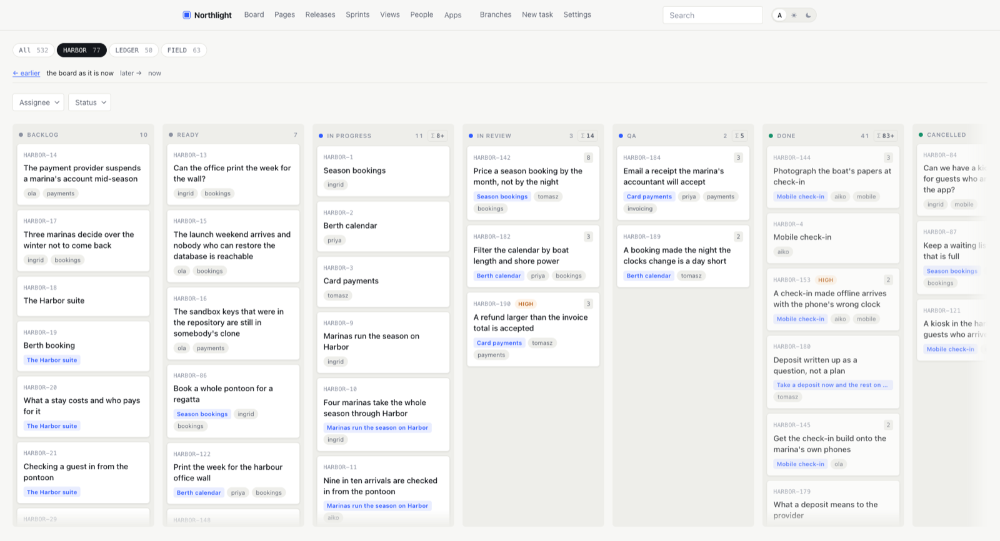
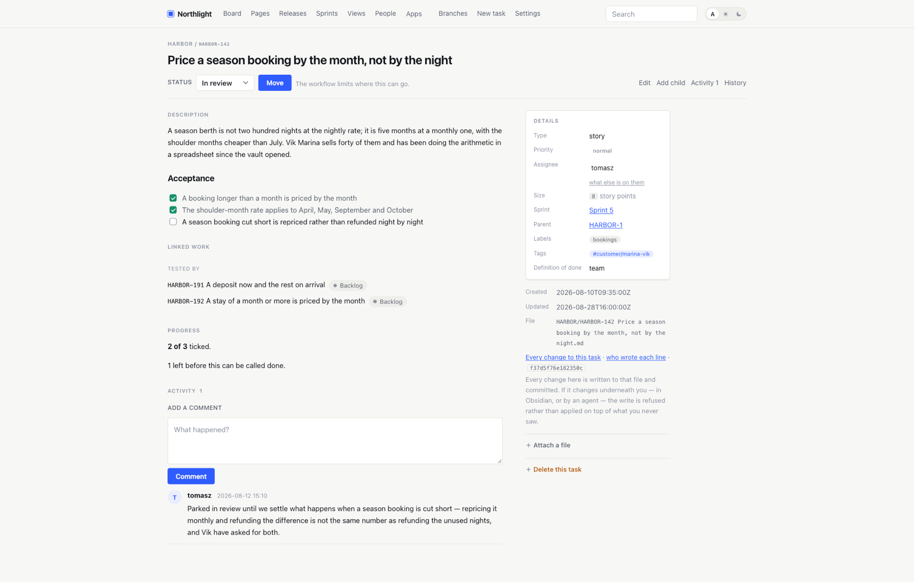
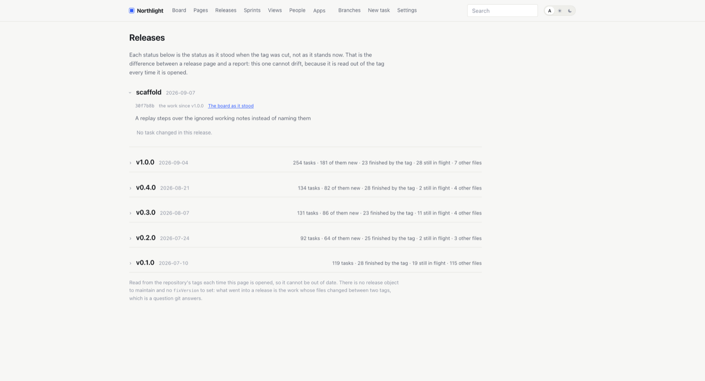

# docket

**Git and Obsidian, made into one tracker that a person and an AI agent both find obvious.**

Neither half is new, and that is the point. Git already keeps a history, reviews a change on the
lines, branches a proposal and says who did what. Obsidian already draws a folder of Markdown as
a board, a backlog, a linked wiki and a graph. What was missing between them was a format each
reads as if it were its own — and a tool that keeps that format honest.

So a task here is a Markdown file in a git repository, and that one decision is what makes all
three readers agree:

- **A person** opens the folder in Obsidian and has a board with columns, cards, backlinks and a
  graph. Or opens `docket serve` and has the board in a browser. Nothing to learn that is not
  already Jira-shaped.
- **An agent** is pointed at the same folder and needs no API, no schema and no credential you
  would not give anyone who can clone the repository — it already knows how to write a file.
  Give it [the skill](#give-it-to-your-agent) and it knows the whole loop.
- **Git** holds the history, because every move is a commit. Nothing has to be running for the
  record to exist, nothing drifts out of step, and `git clone` is the export and the backup.

None of the three views is an export of the others. There is one set of files, and all of them
are writing to it at once.

**And it does what Jira and six paid add-ons do.** Test management, worklogs, a risk register,
OKRs, time in status, portfolio roll-ups: twelve packs, each installed with a URL and reviewed as
a `git diff`. No instance to administer, no seats to buy, no marketplace to ask. When a pack does
not exist, [writing one](#write-your-own) is a manifest and a shell script.

The vault format is settled and the whole local workflow works. A vault is usable without any of
this — clone, open in Obsidian, work — but the tool makes the routine parts routine.

**New here?** [How you work in this](docs/how-you-work-in-this.md) is the shape of a week: who
decides what, where each kind of thing goes, and what you stop doing. Ten minutes, and the rest
of this page makes sense afterwards.

## What it looks like



A board across a quarter's work. The columns are whatever `docket.yaml` says they are; the cards
are files. `← earlier` walks the board backwards through its own history, because the history is
the repository.



A task page in the shape people know — with the acceptance list ticked, the work it is linked to,
and, at the bottom of the details, every change to this task and who wrote each line. Both are
`git log` on one file.



Releases, computed from the tags every time the page is opened. Nothing was set on any task to
produce this, and it cannot drift.

All three are the [showcase vault](https://github.com/didenkolab/docket-showcase) — an
invented company, three products, six people, twelve weeks. Clone it and you get these pages.

## Coming from Jira

docket is a free, open-source, self-hosted alternative to Jira — and to Linear, Asana, Notion
and the rest of the hosted trackers — for teams who would rather own the work as files than rent
it as rows. There is no instance to administer, no seat to buy and no vendor between you and your
own history: the tracker is a git repository, and the board is a program that reads it.

| What you pay for there | What it is here |
|---|---|
| Issues, epics, sprints, a kanban board | Markdown files in a folder, drawn as a board by Obsidian or `docket serve` |
| Workflows, custom fields, screens | `docket.yaml` — your statuses, types, priorities and transitions, in a few lines you can read |
| Xray or Zephyr, for test management | the `tests` pack |
| Tempo, for worklogs and timesheets | the `time` pack |
| Risk registers, OKRs, time in status, portfolio roll-ups, capacity | five more packs, each installed with a URL |
| An audit log, sold as an add-on | `git log` — every move was already a commit |
| The REST API, and a token to call it | `git clone`. An agent reads and writes the files directly, or speaks [MCP](#an-agent-over-a-protocol) |
| Export, so that you could leave | nothing to export; you already have the whole repository |

Twelve packs in all, in [docket-apps](https://github.com/didenkolab/docket-apps). Each arrives as
a diff you read before you commit it, so a pack cannot do anything to a vault that you did not
see first.

**Migrating is three commands**, and only the first one touches the network:

```bash
docket import extract --site https://you.atlassian.net --email you@example.com --token "$JIRA_TOKEN" --snapshot ./snap
docket import plan    --snapshot ./snap
docket import apply   --snapshot ./snap --project ENG --vault ./eng
```

It brings issues, comments, attachments, links, sprints and the workflow itself, and Confluence
spaces come across the same way. `plan` runs against the snapshot, so a mapping can be redone as
many times as it takes without pulling the source again — see
[the cookbook](docs/examples).

**What you give up, honestly.** There is no hosted instance with a signup link; somebody clones a
repository. There are no per-field permissions, because git's boundary is the repository, so
access is per-vault. There are no live cursors — two people editing one task is a merge. If those
three are what you are paying for, keep paying for them.

## Quick start

A vault is a git repository, so make one first — `docket init` fills it and commits, but it does
not create it:

```bash
mkdir acme && cd acme && git init -q
docket init --key ACME --name "Acme Platform"
docket new "Fix login redirect loop" --type bug
docket check
docket serve --auth none --author "Your Name <you@example.com>"
```

Open <http://127.0.0.1:8080>. You should see a board called Acme Platform with six columns —
Backlog, Ready, In progress, In review, Done, Dropped — and one card in Backlog, `ACME-1`. Drag
it to In progress and it lands in git as a commit. The same folder opened in Obsidian is the
same board.

`docket init` clones the template over the network, so the first one needs a connection.

## Give it to your agent

`skill/docket/` is what an agent reads once and then knows how to run a project here.
`SKILL.md` is the loop it works in and the six rules it must not break; `reference.md` beside it
is the detail — documents, labels and tags, estimates, sprints. Install it into Claude Code and
point the agent at a vault:

```bash
cp -r skill/docket ~/.claude/skills/
```

An agent that reads `AGENTS.md` instead gets the same thing with nothing installed — every vault
`docket init` scaffolds carries one. An agent that would rather call a tool than write a file
has [MCP](#an-agent-over-a-protocol). All three drive the same files, and the vault does not
care which made a change — except that it records which did, because every write is a commit
with an author.

What that buys you is the thing a tracker has never been able to offer: the plan and the work
are in one repository, so an agent that is already reading the code is reading the backlog from
the same checkout, and what it did to both arrives in one pull request.

## Requirements

| | |
|---|---|
| git | Required, on the `PATH`. Every write is a commit, and the history is the record |
| Go 1.26 or newer | Only to build from source. A released binary needs no toolchain |
| Obsidian | Optional. The vault is Markdown either way; Obsidian is one of the two ways to read it |
| Python 3.11 or newer, and `sh` | Optional, for the hooks some [apps](https://github.com/didenkolab/docket-apps) bring |
| Docker | Optional, for `compose.yaml` |

## Install

Download the binary for your platform from
[Releases](https://github.com/didenkolab/docket/releases) and put it on your `PATH`. That
is the whole procedure — there is no runtime to install.

With Go already on the machine:

```bash
go install github.com/didenkolab/docket/cmd/docket@latest
```

From a checkout — Go 1.26 or newer, one dependency:

```bash
go build -o docket ./cmd/docket
./docket --version
```

Go and the single-binary distribution were chosen for the reasons in
[ADR-0002](https://github.com/didenkolab/docket-board/blob/main/docs/decisions/0002-go-and-a-single-binary.md).

Check what you have:

```bash
docket version
```

## Usage

A key is `PROJECT-NUMBER`, and the file is named after the task:
`ACME/ACME-1 Fix login redirect loop.md`. The key makes it sortable and unambiguous, the title
makes the graph readable, and `[[ACME-1 Fix login redirect loop]]` resolves in Obsidian with no
help — the reasoning is in
[ADR-0005](https://github.com/didenkolab/docket-board/blob/main/docs/decisions/0005-a-file-is-named-after-its-task.md).
One vault holds as many projects as you like, and links between projects work because the
projects are one file tree.

| Command | What |
|---|---|
| `docket init` | Scaffold a new vault |
| `docket new` | Create a task with a valid key from the project's template |
| `docket project` | List the projects a vault holds, or add one |
| `docket check` | Validate a vault against the specification |
| `docket workspace` | Assemble several project repositories into one Obsidian vault |
| `docket graph` | What shape the vault's links are in |
| `docket people` | Who the work is on, and who has no page yet |
| `docket app` | Install a pack of vocabulary and files |
| `docket report` | What the board cannot say by looking at today |
| `docket anomalies` | What is odd about how the work is connected |
| `docket export` | The tasks, as JSON or CSV — and what an app computes from |
| `docket adopt` | Promote an imported property to what the format calls it |
| `docket set` | Write properties on a task, from a script |
| `docket serve` | A board and an API over the same repository |
| `docket import` | Bring in an existing Jira and Confluence instance |
| `docket mcp` | Serve the vault to an agent over the Model Context Protocol |
| `docket version` | Print the version |

Every one of them works. `docket <command> --help` says what its flags are, and what is not built
yet is on the board in `docket-board`.

## Examples

[`docs/examples/`](docs/examples) is a cookbook: each recipe is a task somebody actually has,
done end to end, with commands that were run before they were written down.

| | |
|---|---|
| [A project, from nothing to a release](docs/examples/a-project-from-nothing-to-a-release.md) | The whole loop in one sitting |
| [A release is a tag](docs/examples/a-release-is-a-tag.md) | Shipping without a version object |
| [Sprints](docs/examples/sprints.md) | A sprint is a page, and being in it is a link |
| [Tests, and results from CI](docs/examples/tests-and-ci.md) | Cases, runs and coverage, fed by your own pipeline |
| [OKRs and the portfolio](docs/examples/okrs-and-the-portfolio.md) | What the quarter was for, rolled up |
| [Write your own app](docs/examples/write-an-app.md) | A manifest and a shell script |
| [An agent runs the board](docs/examples/an-agent-runs-the-board.md) | The skill, MCP, and what to let it do |
| [Moving off Jira](docs/examples/moving-off-jira.md) | Extract, plan, apply — and what to fix after |
| [Many projects, one vault](docs/examples/many-projects-one-vault.md) | A workspace across repositories |
| [What the board cannot see](docs/examples/what-the-board-cannot-see.md) | Anomalies and the shape of the graph |
| [Where the time went](docs/examples/where-the-time-went.md) | Time in status, out of `git log` |
| [Who may do what](docs/examples/who-may-do-what.md) | Access without a user table |

## Write your own

A pack — an app — is a git repository with a `docket-app.yaml` and some files. Installing one
adds its types, fields and relations to `docket.yaml` and copies in its templates, boards, pages
and hooks. Nothing is executed and nothing is committed for you: what an installation did is a
diff.

```bash
docket app add https://github.com/didenkolab/docket-apps.git#tests
git status                       # everything it wrote, unstaged
docket check && git add -A && git commit -m "Installed the app tests"
```

Twelve of them ship in [`docket-apps`](https://github.com/didenkolab/docket-apps) — tests,
time, risks, incidents, intake, OKRs, checklists, estimation, portfolio, workload, time in
status, anomalies. Writing a thirteenth is a manifest and, if it draws something, a script that
prints Markdown; [the recipe](docs/examples/write-an-app.md) walks through one. There is nothing
to register with and nobody to ask.

## Configuration

Three files, and nothing else is state:

| File | Where | What it says |
|---|---|---|
| `docket.yaml` | A vault's root | The projects it holds and the vocabulary they share: statuses and their categories, types and their levels, priorities, fields, relations, and the workflow |
| `workspace.yaml` | A workspace's root | The project repositories assembled into one Obsidian vault |
| `docket-app.yaml` | An app's root | The vocabulary and files a pack brings |

`docket serve`:

| Flag | What |
|---|---|
| `--addr` | Address to listen on (default `127.0.0.1:8080`) |
| `--auth` | `auto`, `git`, or `none` (default `auto`) |
| `--author` | Who unauthenticated writes are attributed to, as `"Name <email>"` |
| `--programs` | Run the programs this vault declares — its reactions, pages and panels. Off unless said here |
| `--behind-proxy` | A reverse proxy sits in front, so rate limits follow the client it names |
| `--host`, `--api` | Which git host the remote is, and its API base URL — needed only for a self-hosted one |
| `--device-client-id` | Override the OAuth application people sign in with, for this server only |
| `--session`, `--recheck` | How long a session lasts (12h), and how often the host is re-asked about a signed-in person (5m) |
| `--template` | The repository a new project is scaffolded from |

Environment. docket itself reads two:

| Variable | What |
|---|---|
| `DOCKET_TOKEN` | The API token for `docket import extract`, instead of `--token` |
| `DOCKET_DEVICE_CLIENT_ID` | The same as `--device-client-id` |

And it sets these for a program it runs, so a hook asks docket for data rather than parsing the
vault itself:

| Variable | What |
|---|---|
| `DOCKET_ROOT` | The vault on disk |
| `DOCKET_BIN` | This binary |
| `DOCKET_EVENT` | What happened, for a reaction |
| `DOCKET_PREFIX` | Where the vault sits in the server's URL space — empty for a repository, set in a workspace — so a link a hook writes resolves |

Hooks that apps bring read a few of their own — `DOCKET_JUNIT_SECRET`, `DOCKET_AUTHOR_NAME` and
`DOCKET_AUTHOR_EMAIL`, `DOCKET_ENVIRONMENT`, `DOCKET_REVISION` — and are documented in
[`docket-apps`](https://github.com/didenkolab/docket-apps).

## How it works

### A board in the browser

For people who do not run Obsidian:

```bash
docket serve                       # signs people in against the repository's git host
docket serve --auth none --author "Your Name <you@example.com>"   # one person, no sign-in
```

A board grouped by status across every project at once — or narrowed to one — with cards you
drag between columns and up and down inside them, plus task pages, the wiki, a search you can
narrow by project, status, type, priority, assignee and label, settings, and a JSON API.

Dragging a card is the same status move as the form on the task page: it goes through the API,
is checked against the fingerprint the card was drawn from, and lands in git as a commit. Where
it lands in the column is written down too, as an `order` on the task, so a column somebody
arranged is still arranged after a reload — and a vault where nobody has dragged anything is
simply sorted by key. Dragging is an enhancement, not the mechanism: without JavaScript the
board is still a board and every task page still moves its own status.

#### An epic, a label and a task are joined by links

`parent` and `labels` are wikilinks, not words:

```yaml
parent: "[[ACME-4 Session model]]"
labels: ["[[auth]]", "[[regression]]"]
```

That is the difference between this being Obsidian with tracking on top and being a database
that keeps its rows in Markdown. A wikilink is the only pointer Obsidian resolves, draws in its
graph and counts as a backlink — so an epic has an edge to each of its tasks, and a label is a
hub joining everything that carries it, across projects. The same words written plainly connect
nothing and exist only for docket's own tools.

A label link need not resolve. `[[auth]]` groups whatever carries it whether or not `auth.md`
exists; writing that page under `docs/` is what gives the label somewhere to explain itself and
gather what belongs to it. `tags` works too, since Obsidian already understands it.

Retitling therefore rewrites every link to the renamed note — bodies and frontmatter alike, in
the same commit as the rename, so no point in the history has the vault pointing at nothing.
`docket check` reports a relationship still written as a string, and `docket check --fix` rewrites
it.

#### How two tasks are connected

`parent` is hierarchy. How else two pieces of work relate is a property whose name is the verb:

```yaml
blocked_by: ["[[ACME-4 Session model]]"]
relates: ["[[BETA-7 Ship the widget]]"]
```

Seven of them, in inverse pairs — Jira's set, which needs a database table and an admin screen
there and is a line of frontmatter here. Written as links, so each one is an edge in the graph
and shows in backlinks.

They carry no structure: `parent` decides what the board does, a relation is something a person
reads. The exception is the one that changes what you pick up next — a task waiting on
unfinished work is marked **blocked** on the board, and blocked by something already done is not
blocked.

#### A plan on a branch

A branch is a proposal about the plan — a release re-scoped, an epic split, a quarter dropped.
The **Branches** page lists them, and opening one draws the board as it would be, read out of
the repository rather than off the disk:

```bash
git switch -c proposal/drop-the-exporter
# edit the plan, commit, push, open a pull request
```

The diff is exactly what changed: which tasks moved, what their acceptance criteria became,
which were dropped. Reviewed the way code is reviewed, on the lines. Merged in one commit, or
closed, and nothing happened.

No tracker can do this. A plan change in Jira is applied immediately and irreversibly to the one
live instance, and the record of it is an activity feed nobody reads. There is no plan on a
branch, no plan under review, and no way to look at two candidate plans.

Looking at a proposal writes nothing and does not touch the working tree, so it cannot disturb
whoever is working in it. The cards there are not draggable, the page says which branch it is,
and a proposal is changed by checking it out.

#### A release is a tag

There is no version object, no `fixVersion` to set and no release notes to generate. A release
is a git tag, and what went into it is the work whose files changed since the tag before it:

```bash
git tag -a v1.2.0 -m "What this release is"
```

The **Releases** page reads that out of the repository every time it is opened, so it cannot be
out of date. Jira keeps a version object, a field on every issue pointing at it, and a generator
that turns the two into notes — three records of one fact, kept in step by hand. Here there is
one, and git maintains it.

Ordered by the commit each tag points at rather than by when somebody typed the tag command,
because tagging is often retroactive and three releases labelled in one afternoon have tag
dates minutes apart.

#### What happened to this task

Every change is a commit, so the history of a task is the history of its file — and the
interface shows it as a tracker does rather than as a diff: who, when, and which fields moved.
`status  Backlog → In review`, `added 1 comment`, `edited the description`.

It is read from git on the way past. There is no activity table to fall out of step with the
files, and a change made in Obsidian or by an agent appears here beside one made on this page,
because there was only ever one record.

A task's history is found by its key rather than by following one file. A retitle renames the
file, and git can only follow a rename by guessing from how similar the two versions look — a
retitle that also rewrites the body falls under the threshold, and the history silently stops.
The key is in the file name, so `ACME/ACME-12 *.md` is the whole life of ACME-12 and nothing
else, decided by the format instead of by a heuristic.

#### Who may do what

docket keeps no users of its own. People sign in with a token for the git host that already
holds the repository — GitHub, GitLab or Bitbucket, hosted or your own — and what they may do
is what that host says they may do: read becomes **viewer**, write becomes **member**, and
administer becomes **admin**, who may also change the vault's vocabulary. Commits are authored
by the person who made them, so `git log` says who moved what.

Access is granted on the host, not here. Anyone who can clone the repository has everything in
it, so a button in this interface would appear to hand out something it cannot. The reasoning
is in
[ADR-0004](https://github.com/didenkolab/docket-board/blob/main/docs/decisions/0004-access-comes-from-git.md).

#### Standing up to the open internet

A change has to come from a page this server drew. Every form carries a token that lives in a
cookie the page cannot read, and a request that admits to coming from another origin — by
`Sec-Fetch-Site` or by `Origin` — is refused before anything else is looked at. A client with no
cookies at all is not asked for a token: an agent or a `curl` has no ambient session to hijack,
and demanding a `GET` before every write would buy nothing.

Requests are metered per client: generous for reading, tighter for writing, and much tighter for
signing in, because every sign-in attempt is a call to the git host and a loop against it burns
that host's rate limit for everyone. Behind a reverse proxy, pass `--behind-proxy` so the limit
follows the client the proxy names rather than the proxy itself.

Pages are served under a content security policy with no inline anything, and attachments are
served sandboxed — an uploaded SVG is still embeddable as an image but cannot run as a page.
An interrupt stops taking new requests and lets the ones in flight finish, because a write is a
file and then a commit, and stopping between the two leaves a change git never saw.

None of this replaces the git host. Anyone who can clone the repository has everything in it;
what is here keeps a browser from being used against its owner.

#### The workflow

Which status may move to which is part of the vault's configuration, so it lives in
`docket.yaml` and changes to it show up in `git log` like everything else. Leave it out and any
task can go anywhere, which is what a new vault does. Set it and only the allowed moves are
offered — on the board, on the task page and through the API alike. It is a second client
to the same files, not an owner of them: nothing is cached, every write becomes a git commit
attributed to whoever made it, and a write that would land on top of a change made in Obsidian
or by an agent is refused rather than applied. Point all three at one repository at once.

#### Running it somewhere

In a container, with `compose.yaml` from this repository:

```bash
VAULT=~/work/acme docker compose up
```

That builds from the checkout, so it needs nothing but Docker — no registry, no login, no
token. `VAULT` is the repository to serve and defaults to the directory you run it from;
`PORT` and `AUTH` are the other two knobs.

The vault is not in the image. It is your git repository, mounted — baking it in would make the
image the source of truth, which is the opposite of the whole design. The image carries the
binary, git and certificates and keeps no state, so restarting it loses nothing and two of them
against one clone is only a question of file locking.

There is a published image as well — `ghcr.io/didenkolab/docket` — which needs a
`docker login ghcr.io` for as long as this repository is private. Building does not, which is
why compose builds by default.

Or without any of it, since this is one static binary: put it on the machine, clone the vault
beside it, and run `docket serve --auth git`.

Behind a reverse proxy that terminates TLS, add `--behind-proxy` so rate limits follow the
client the proxy names rather than the proxy. `--auth git` makes who may do what a question for
the git host rather than for whoever finds the port.

To let a server take changes people push to the remote — and to push its own back — pull on a
schedule beside it; docket does not fetch on its own, because a tracker that rebases your working
copy out from under you is a tracker you stop trusting.

### An agent, over a protocol

An agent can edit the files directly — that is the point of the format, and nothing here
replaces it. But an agent driving a tracker wants "move this to In review" to be one call that
validates, writes and commits, not four file operations that might each be half-right. That is
what `docket mcp` is:

```bash
docket mcp --author "Claude <claude@example.com>"
```

It speaks JSON-RPC on stdin and stdout — eight tools: `list_tasks`, `get_task`, `create_task`,
`update_task`, `search`, `read_page`, `write_page`, `check`. In Claude Code:

```bash
claude mcp add docket -- docket mcp --author "Claude <claude@example.com>" /path/to/vault
```

`--author` is required, because every write becomes a git commit and an agent's commits should
say which agent made them. `get_task` returns a `version` — the same fingerprint the board
draws its cards from — and `update_task` refuses a write whose version no longer matches, so an
agent cannot land on top of an edit somebody made in Obsidian while it was thinking. The
workflow applies here exactly as it does on the board: a move the vault forbids comes back as
an error that names the moves it allows instead.

### A workspace

Several projects, each its own repository, opened in Obsidian as one vault:

```bash
docket workspace init space && cd space
docket workspace add --key ACME --remote git@github.com:example/acme.git
docket workspace sync
```

`sync` clones what is missing and fast-forwards what is there. A project with uncommitted
changes is reported and left alone.

## Where things are

| Repository | What |
|---|---|
| [`docket`](https://github.com/didenkolab/docket) | This one: the CLI, the server and the MCP endpoint, as one Go binary |
| [`docket-apps`](https://github.com/didenkolab/docket-apps) | Packs of vocabulary and files a vault takes on — tests, time, risks, OKRs and eight more |
| [`docket-board`](https://github.com/didenkolab/docket-board) | The format's specification, the decisions and the roadmap — and the project's own board, which makes it the working example |
| [`docket-template`](https://github.com/didenkolab/docket-template) | What a new vault starts as. `docket init` clones it |
| [`docket-demo`](https://github.com/didenkolab/docket-demo) | A small vault to open and look at: two projects, seven tasks and a page |
| [`docket-showcase`](https://github.com/didenkolab/docket-showcase) | An invented company's vault: three products, six people, twelve weeks, and every app installed — built by a generator |
| [`northlight`](https://github.com/didenkolab/northlight) | That invented company's code, beside its vault |

All of them are public. `docket init` clones the template, so that one has to be.

The demo is the format in a minute. To see the whole of it on a team's worth of work, clone
[`docket-showcase`](https://github.com/didenkolab/docket-showcase): three products, six
people, twelve weeks and every app, all invented.

## Contributing

```bash
go build ./...
go test ./...
```

`docket check` prints a file and a line for every finding and exits non-zero when there is at
least one, so it works as a vault's pre-commit hook:

```sh
#!/bin/sh
exec docket check .
```

Work is tracked on the board in `docket-board`, where a task is a Markdown file — so a change to
the plan is a pull request, reviewed on the lines, like a change to the code.

## License

MIT — see [LICENSE](LICENSE).
